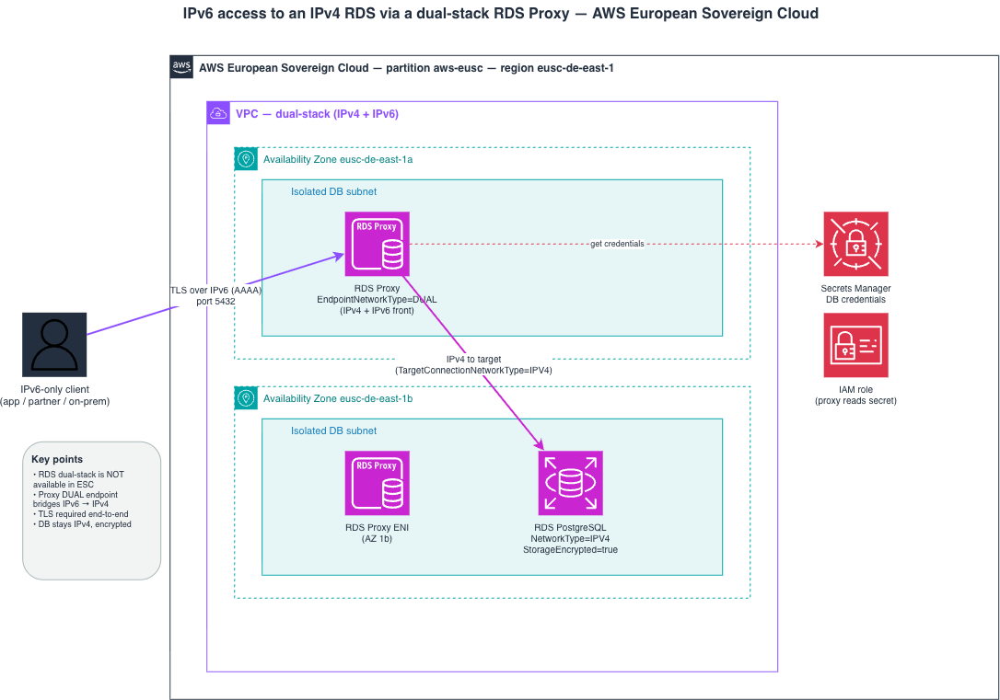

# esc-dualstack-rds

IPv6 access to an **IPv4 RDS PostgreSQL** instance in the **AWS European Sovereign Cloud** (`eusc-de-east-1`), where native RDS dual-stack (`NetworkType DUAL`) is **not available**.

> [!WARNING]  
>## ⚠️ Important Disclaimer
>
>**This project is for testing and demonstration purposes only.**
>
>Please be aware of the following:
>
>- The infrastructure deployed by this project is not intended for production use.
>- Security measures may not be comprehensive or up to date.
>- Performance and reliability have not been thoroughly tested at scale.
>- The project may not comply with all best practices or organizational standards.
>
>Before using any part of this project in a production environment:
>
>- Thoroughly review and understand all code and configurations.
>- Conduct a comprehensive security audit.
>- Test extensively in a safe, isolated environment.
>- Adapt and modify the code to meet your specific requirements and security standards.
>- Ensure compliance with your organization's policies and any relevant regulations
>  (including data sovereignty and residency requirements applicable to the AWS
>  European Sovereign Cloud).
>
>The maintainers of this project are not responsible for any issues that may arise from
>the use of this code in production environments.

## The problem

RDS dual-stack is not supported in the AWS European Sovereign Cloud. Verified live:

```
$ aws rds create-db-instance --network-type DUAL ... --region eusc-de-east-1
NetworkTypeNotSupported: Network type DUAL isn't supported.
```

`--network-type IPV4` is accepted. So IPv6 clients cannot connect directly to RDS.

## Architecture



The editable source (with official AWS icons) is in
[`docs/architecture.drawio`](docs/architecture.drawio). Open it at
[app.diagrams.net](https://app.diagrams.net), or with the draw.io desktop app or the
draw.io VS Code extension.

Flow:

```
IPv6-only client ──TLS over IPv6──▶ RDS Proxy (EndpointNetworkType=DUAL)
                                        │ IPv4 (TargetConnectionNetworkType=IPV4)
                                        ▼
                                    RDS PostgreSQL (NetworkType=IPV4, encrypted)
```

## The solution

A **dual-stack RDS Proxy** sits in front of the IPv4 database. The proxy accepts IPv6
on its endpoint and speaks IPv4 to the database:

```
Client IPv6 ──TLS(IPv6)──▶ RDS Proxy (EndpointNetworkType=DUAL) ──IPv4──▶ RDS PostgreSQL (IPV4)
```

RDS Proxy exposes two independent network-type settings:

| Setting | Role | Value |
|---------|------|-------|
| `EndpointNetworkType` | client side (proxy front) | `DUAL` (IPv4 + IPv6) |
| `TargetConnectionNetworkType` | database side | `IPV4` |

Only `TargetConnectionNetworkType=IPV6` requires a dual-stack DB; `IPV4` is allowed —
which is the case here since the RDS instance runs in `NetworkType.IPV4`.

## What this stack creates

- A **dual-stack VPC** (IPv4 + IPv6) with isolated DB subnets across 2 AZs
- An **RDS PostgreSQL 16** instance in `NetworkType.IPV4`, Multi-AZ, GP3 storage
- A **dual-stack RDS Proxy** (`EndpointNetworkType=DUAL`, `TargetConnectionNetworkType=IPV4`, TLS required)
- Security groups wiring: IPv6 clients → proxy → RDS

> The `EndpointNetworkType` / `TargetConnectionNetworkType` properties are set via an
> L1 escape hatch (`addPropertyOverride`) because they are not yet exposed by the L2
> `DatabaseProxy` construct.

## ESC-specific notes

- Partition `aws-eusc`, region `eusc-de-east-1`, endpoint suffix `amazonaws.eu`.
- Authenticate with valid credentials for your ESC account before deploying.
- `tsconfig.json` has `exactOptionalPropertyTypes: false` (aws-cdk-lib requires it).
- The stack overrides `availabilityZones` with `Fn.getAzs()` to avoid a credentialed
  AZ context lookup, keeping it deployable in any region/partition.

## Validation

Verify the stack before deploying:

```bash
npm run build     # TypeScript type-check
npx cdk synth     # synthesize CloudFormation (no credentials needed)
```

The synthesized template exposes the key properties: RDS `NetworkType: IPV4`,
proxy `EndpointNetworkType: DUAL` / `TargetConnectionNetworkType: IPV4`, `RequireTLS: true`,
and `StorageEncrypted: true`.

Once deployed, the proxy endpoint resolves to both `A` (IPv4) and `AAAA` (IPv6) records,
so clients can reach the IPv4 database over either address family through the proxy.

> The CDK CloudFormation execution role must allow `rds:*` (see note above).

## Usage

```bash
npm install
npm run build          # tsc type-check
npx cdk synth          # synthesize CloudFormation (no credentials needed)

# Deploy (requires valid credentials for your ESC account)
export CDK_DEPLOY_REGION=eusc-de-east-1
export ALLOWED_CLIENT_IPV6_CIDR="2001:db8::/32"   # restrict to your clients
npx cdk deploy
```

> [!IMPORTANT]
> **Deployment requires the CDK CloudFormation execution role to allow `rds:*`.**
> If your CDK bootstrap uses a scoped execution policy that whitelists services and
> **excludes RDS**, `cdk deploy` fails at the `AWS::RDS::DBSubnetGroup` step with:
> `not authorized to perform: rds:DescribeDBSubnetGroups`.
> This is an environment/bootstrap IAM restriction, **not** a stack error — `cdk synth`
> and the non-RDS resources succeed. Fix by re-bootstrapping with an execution policy
> that includes `rds:*`, or deploy in an account whose CDK exec role permits RDS.

### Configuration (environment variables)

| Variable | Default | Purpose |
|----------|---------|---------|
| `CDK_DEPLOY_REGION` | `eusc-de-east-1` | Target region |
| `ALLOWED_CLIENT_IPV6_CIDR` | **(required)** | IPv6 range allowed to reach the proxy. **Required — no default; `::/0` is rejected.** Set to your clients' specific CIDR (e.g. `2001:db8:abcd::/48`) |
| `MULTI_AZ` | `true` | Multi-AZ RDS instance |

## Cost (reference: eu-central-1, On-Demand, ~730 h/month)

| Component | Monthly |
|-----------|---------|
| RDS db.t3.micro Single-AZ | ~$15.33 |
| GP3 storage (20 GB) | ~$5.48 |
| RDS Proxy (2 vCPU) | ~$21.90 |
| IPv6 / dual-stack | $0 |
| **Total (Single-AZ)** | **~$42.71** |

Multi-AZ roughly doubles the instance cost (~$58/month total). The RDS Proxy is the
dominant line item and scales with the DB instance vCPU count. IPv6/dual-stack adds no
charge. **ESC does not publish separate pricing — apply the ESC premium for a real quote.**

## Security / production hardening

- Set `ALLOWED_CLIENT_IPV6_CIDR` to your real client range (not `::/0`). This is now
  **enforced**: the app requires the variable and the stack rejects `::/0`.
- Enable `deletionProtection` and change `removalPolicy` away from `DESTROY`.
- **Backups (M3):** set a real `backupRetention` (e.g. `Duration.days(7)`) for
  point-in-time recovery — the demo uses a short/zero retention.
- **Egress (L1):** the security groups use `allowAllOutbound: true` for convenience.
  In production set `allowAllOutbound: false` and add explicit egress rules (DB SG ↔ proxy
  SG on the DB port only).
- **Secret rotation (L3):** the generated DB secret has no automatic rotation. Enable
  Secrets Manager rotation (e.g. `db.addRotationSingleUser()`) in production.
- **Audit logs (L4):** no DB log export is configured. Add
  `cloudwatchLogsExports: ['postgresql']` to ship PostgreSQL logs to CloudWatch for audit.
- **KMS (sovereignty):** `storageEncrypted` uses the default AWS-managed key. For strict
  sovereignty, use a customer-managed KMS key (or External Key Store / XKS).
- With `sslmode=verify-full`, the client hostname must match the server certificate —
  plan a custom DNS name + certificate if clients connect through a non-RDS name.

## License

This project is licensed under the **MIT License** — see the [LICENSE](LICENSE) file for details.
